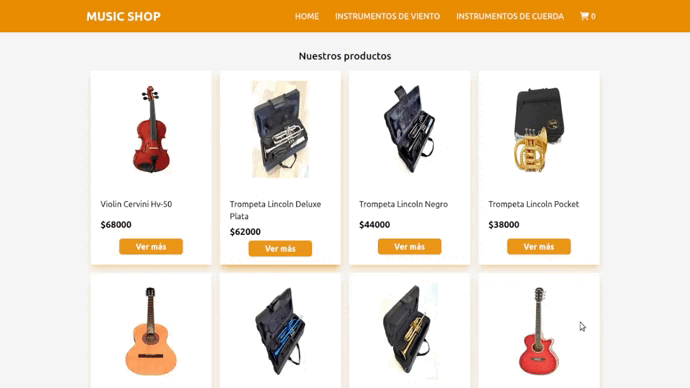
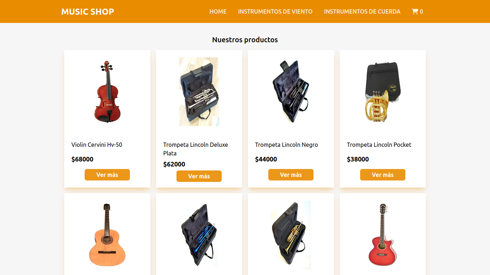
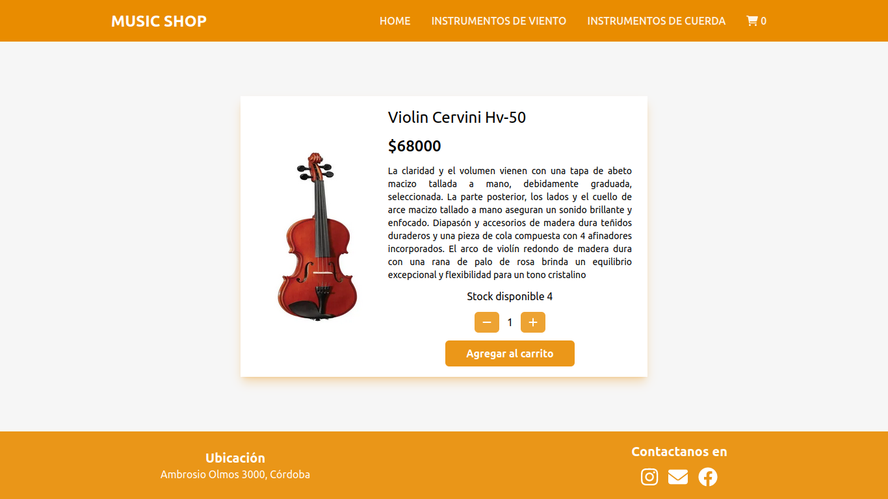
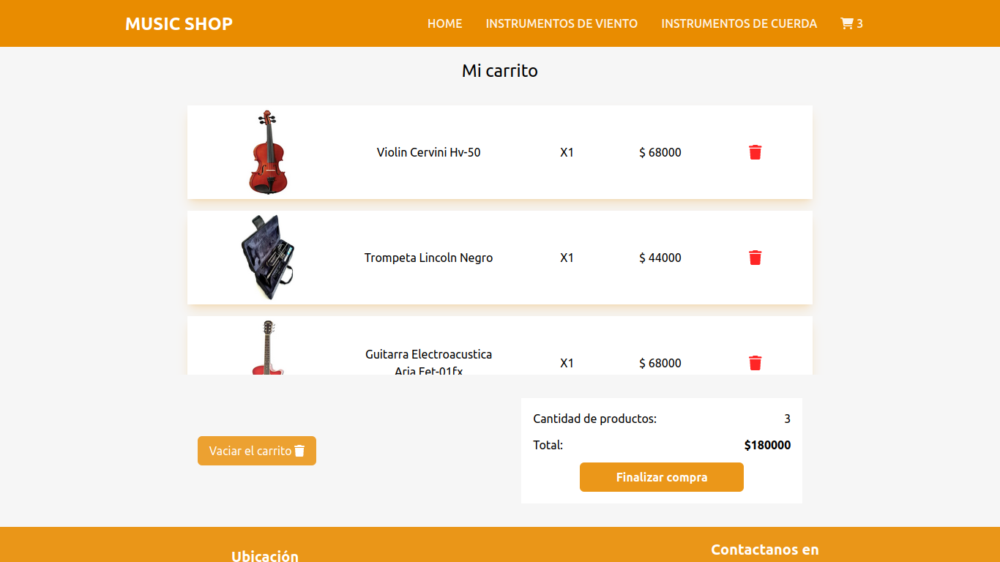
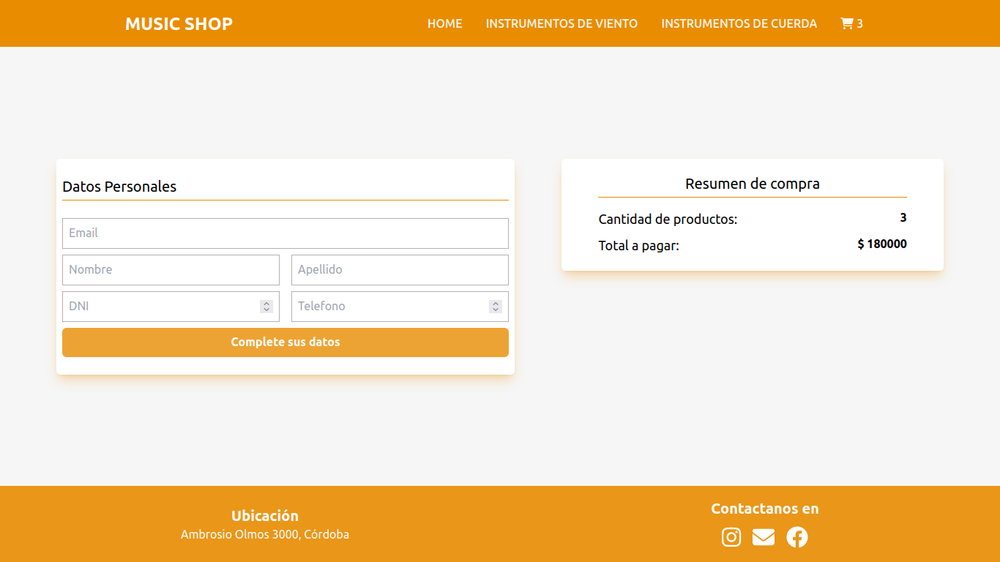
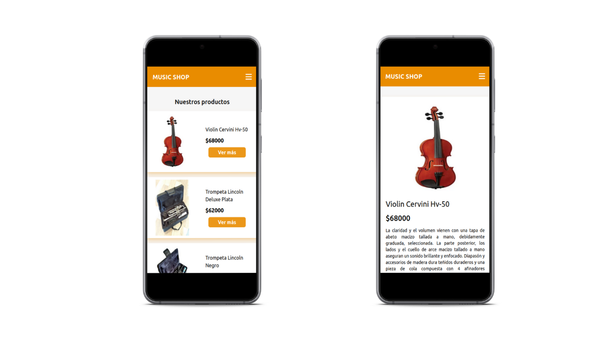
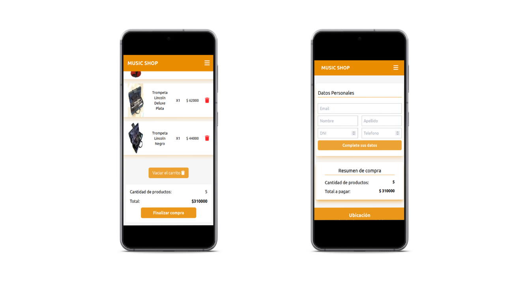

# Music Shop

Ecommerce de instrumentos musicales, cuenta con diferentes categorias según el tipo de instrumento. Con vista de detalle sobre los productos. Además se incluye un carrito para poder agregar los productos a comprar, y luego para finalizar cuenta con un formulario para ingresar datos del comprador.

## Caracteristicas

> * Diseño en base a paleta de colores.
> * Maquetado utilizando react js y Tailwind.
> * Diseño Full Responsive.
> * Carrito de compras, con vista de productos agregados y posibilidad de modificarlos.
> * Lectura de datos sobre productos desde Base Firebase.
> * Registro de compras en Firebase.

# Demo

# Desktop

# Mobile

